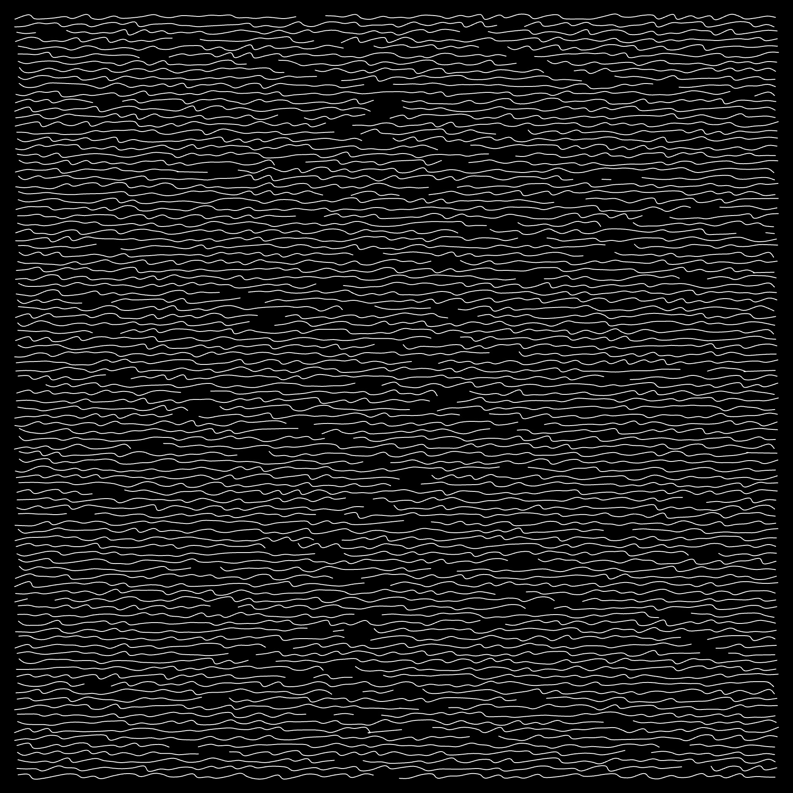

# Coffee

Hello, I am drinking coffee and trying to come up with inspiration. I enjoy drining black coffee, especially when iced, and so it strangely got me thinking about creating a project in black and white.

I am also feeling lazy (I have not consumed much of the coffee yet), so will be posting intermitant images of the work and not commenting on what I am doing. I hope I rememeber to do it in invrements small enough to make the work and my creative process paletable.

Crap and just like that I have made a lot of progress before updating you at all. Well here is what I've got now.




## Final Images


## Source Code

```js
const NOISE_DIFF = 20;

let n_lines = 350;
let n_dots = 200;
let y_padding = 20;
let x_padding = 20;
let x_displacement = 3;
let y_displacement = 3;
let radius = 2;
let max_spaces = 4;
let space_width = 2;
let coupling = 1.1;

let curveAngle;

function setup() {
    createCanvas(windowHeight, windowHeight);
    noiseDetail(4);
    strokeWeight(.25);
    curveAngle = random(TWO_PI);
}

function draw() {
  smooth();
  background(0);
  stroke(255);
  noFill();
  noLoop();

  let padded_width = width - 2 * x_padding;
  let padded_height = height - 2 * y_padding;

  let cx = width / 2;
  let cy = height / 2;
  let curveRadius = width;

  for (let i = 0; i < n_lines; i++) {
    let y = y_padding + i * padded_height / (n_lines - 1);
    let num_words = floor(random(2, max_spaces));
    let starts = new Array(num_words);
    let ends = new Array(num_words);
    let total = 0;

    let ArrayLengths = [0];
    for(let i=1; i<=num_words;i++) {
      ArrayLengths[i] = random(0, 1);
      total += ArrayLengths[i];
    }

    for(let i=1; i<=num_words;i++) {
      ArrayLengths[i] *= (n_dots-1-space_width*(num_words-1))/total;
    }

    let rem = 0;
    total = 0;
    starts[0]=0;
    ends[num_words-1] = n_dots;

    for(let i=0;i<=num_words;i++) {
      let new_rem = (ArrayLengths[i]+rem)%1;
      ArrayLengths[i] = total + round(ArrayLengths[i]+rem);
      if(i>0) {
        ends[i-1] = ArrayLengths[i];
        total = ArrayLengths[i]+space_width;
      }
      starts[i] = total;
      rem = new_rem-round(new_rem);
    }

    let word_number = 0;
    let skip_counter = 1;
    beginShape();
    
    for (let j = 0; j < n_dots; j++) {
      if(j==ends[word_number]) {
          word_number++;
          skip_counter = 2+space_width;
      }

      let x = x_padding + j * padded_width / (n_dots - 1);

      let angleOffset = map(x, 0, width, -PI / 2, PI / 2);
      let curveY = cy + curveRadius * sin(curveAngle + angleOffset);

      let diagDist = abs(y - curveY);
      let factor = map(diagDist, 0, 1000, 8, 0.1);
      factor = constrain(factor, 0.1, 8);

      let x_delta = random(-x_displacement, x_displacement) * factor;
      let y_delta = (1-coupling)*random(-y_displacement, y_displacement);
      y_delta -= coupling * x_delta*y_displacement/x_displacement;

      if(skip_counter==2+space_width) {
          curveVertex(x + x_delta, y + y_delta);
          curveVertex(x + x_delta, y + y_delta);
          endShape();
          skip_counter--;
      } else if (skip_counter<2*space_width & skip_counter>1) {
          skip_counter--;
      } else if (skip_counter==1) {
          beginShape();
          curveVertex(x + x_delta, y + y_delta);
          curveVertex(x + x_delta, y + y_delta);
          skip_counter --;
      } else {
          curveVertex(x + x_delta, y + y_delta);
      }
    }
  }
}
```
