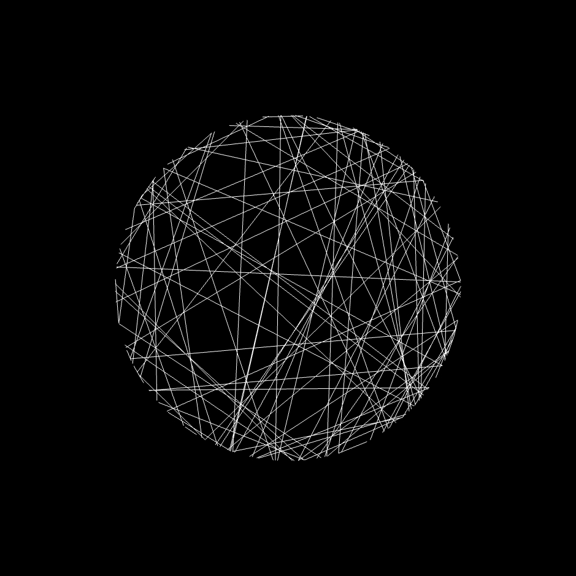
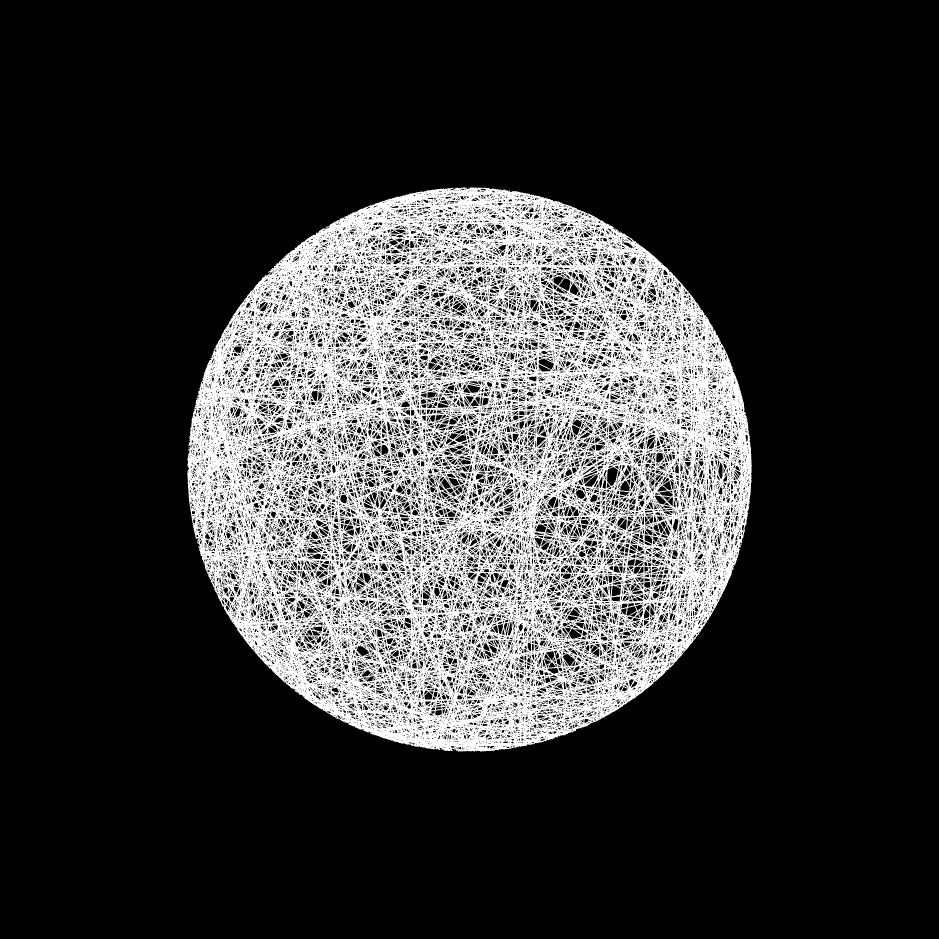
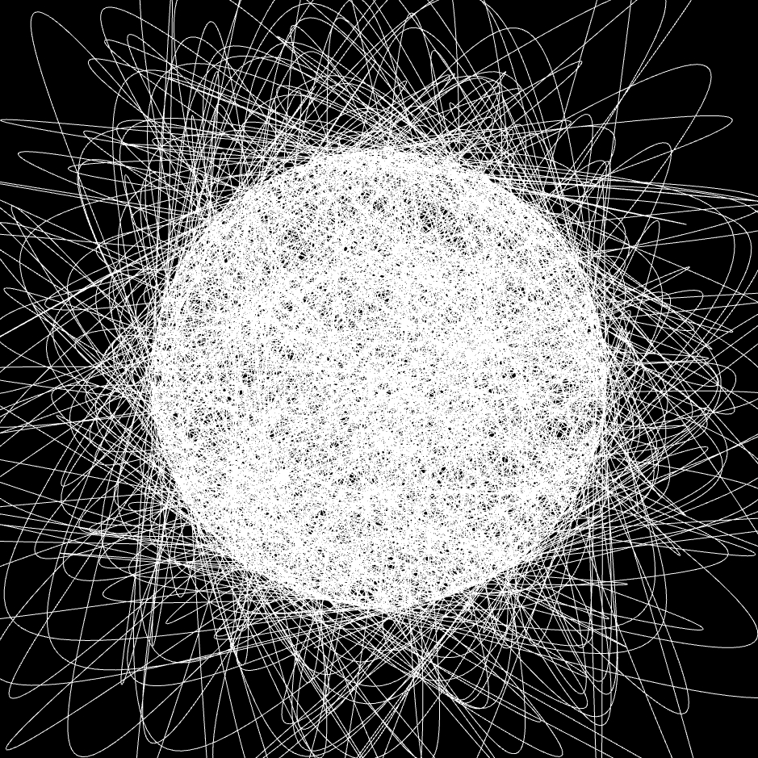
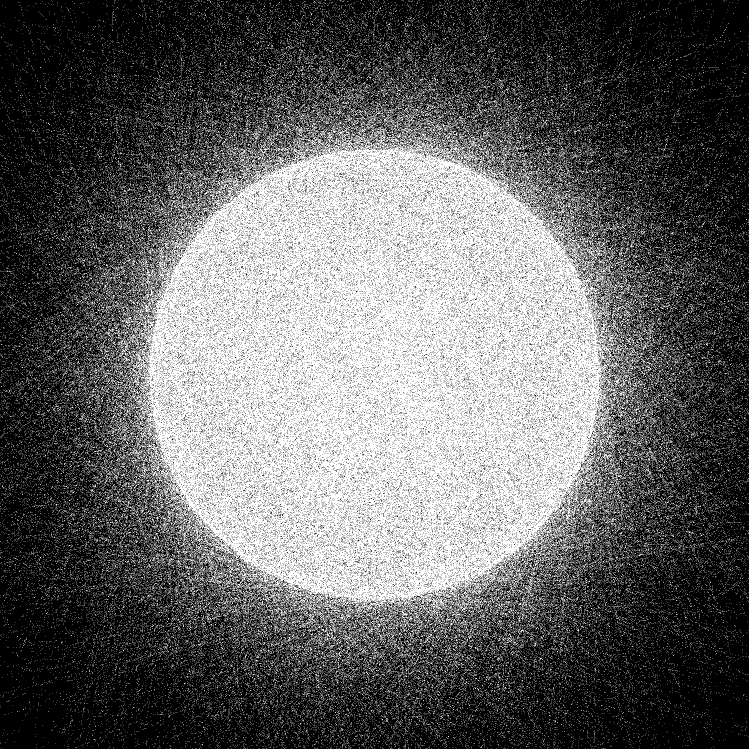
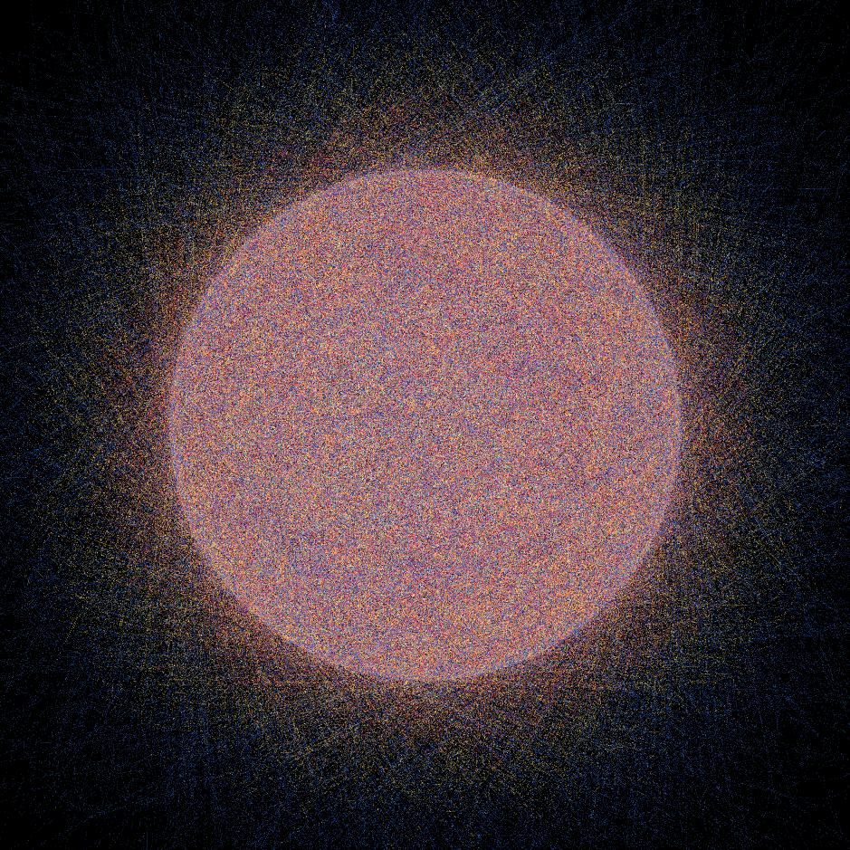
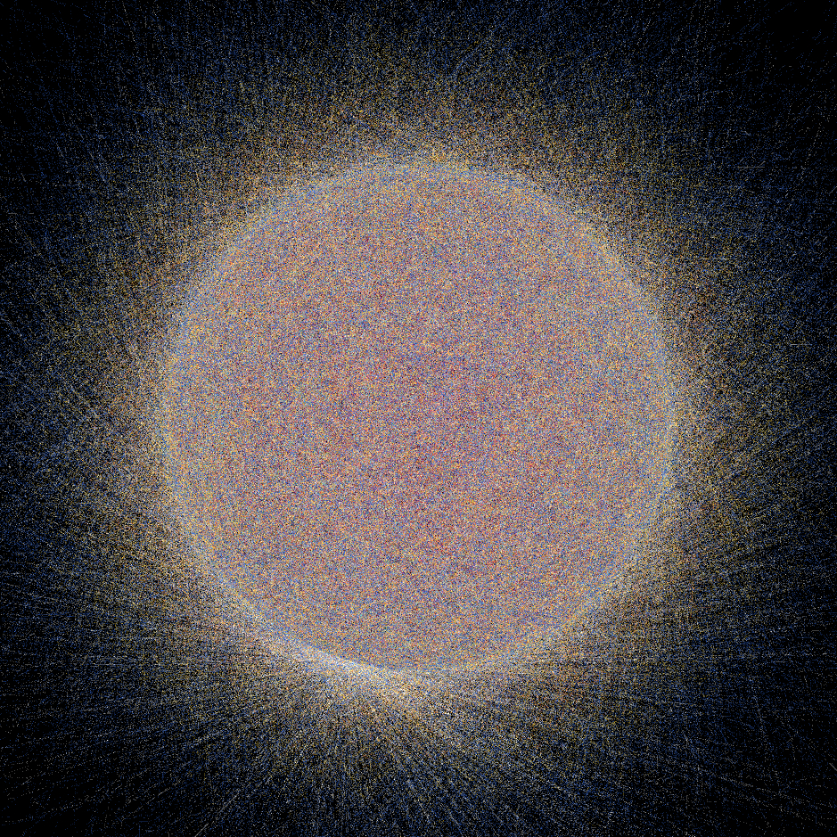
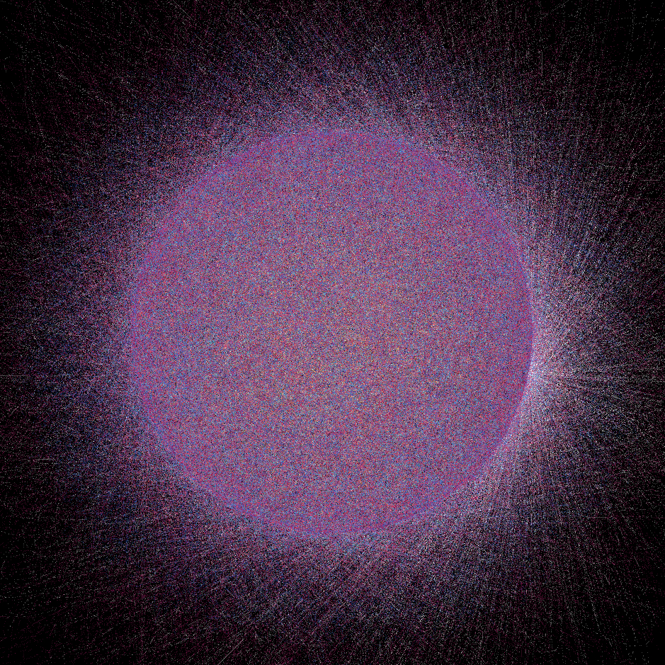
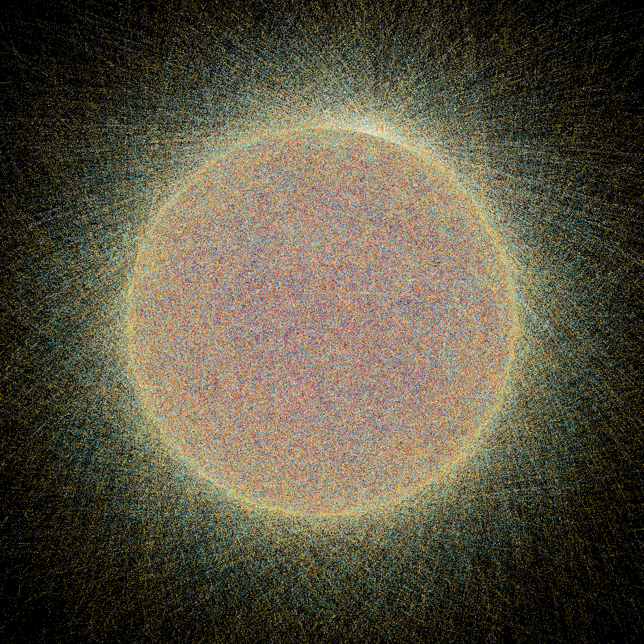
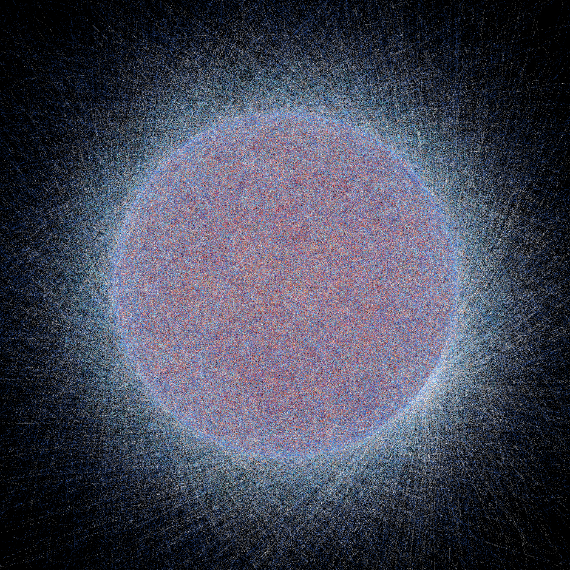

# Eclipse Web

Hello, World!

This is my first blog post here on this little blog site I've set up -- I am still ironing out the kinks, so I hope you are able to see this.

I am Kevin Ewing, a software engineer and hobby generative artist. I love being able to explore my personal creativity through code. This is why, ever since my university class on generative art, I have used `p5.js`.

## Starting with a circle

I have not played around too much with curves in `p5.js`, so I want to create a project centered around them. To start, I am not thinking much about the composition, as I usually find it along the way. I am just going to try to get some curves down on the page. I already know that I want to have many curves scattered, but I don’t want them randomly. I want them all coming off of a central circle of the canvas and connecting to another spot on the circle.



Awesome, that is at least proof that the lines are connecting between two points on a circle in the center of the canvas. However, it doesn’t quite achieve what I am hoping for. Time to add more lines.



## I want curves

Oh, that is much better. Lines are interesting, but I have been thinking a lot about curves. Let’s turn those lines into a bunch of randomized Bézier curves. To do that in `p5.js`, we need to add a control point between the start and end points. Let’s select another random point—this time, Gaussianly distributed around the center of the canvas. This means it will most often pick control points in the middle of the circle. The further away from the circle, the rarer the control point. Let’s see what we get.



That’s pretty neat to me. It is reminiscent of planetary orbits. Let’s see what happens if I dramatically drop the stroke weight and add more lines until the illustration starts to fill up again.



## Let there be color

I want to add color. However, because there are so many lines, I don’t want to do it randomly, or the color will be lost. I am going to organize the curves by their control point’s distance to the center. Curves in the very center will be one color of the randomly generated palette, the middle ones another, and finally, the outermost, outlier curves will be the last (except I am doing this with eight colors rather than just three).



## I want a focal point

Right now, the composition is interesting, but there isn’t necessarily a spot for the eye to rest. I want to add that. I am going to pick another random spot along the circle. It will generate far more lines at that point than any other point on the canvas. This should give the eye something to settle on. Let’s see what that looks like.



I am very content with this final output. Time to refresh, let randomization take the wheel, and find some outputs that we love!

## Some of the final images







## Source Code

```js
const NOISE_DIFF = 20;
const NOISE_DF = 1;
const NUM_CURVES = 20000;
const HIGHLIGHT_COUNT = 10000;

let COLORS = [
  "#2b0f54",
  "#ab1f65",
  "#ff4f69",
  "#fff7f8",
  "#ff8142",
  "#ffda45",
  "#3368dc",
  "#49d9ec",
];

function setup() {
  createCanvas(windowHeight, windowHeight);
  noFill();
  strokeWeight(.05);
  noLoop();
}

function draw() {
  background(0);
  let centerX = width / 2;
  let centerY = height / 2;
  let circleRadius = min(width, height) * 0.3;

  let shuffledColors = COLORS.slice().sort(() => random() - 0.5);

    // Generate a random highlight point on the circle
    let highlightAngle = random(TWO_PI);
    let highlightX = centerX + cos(highlightAngle) * circleRadius;
    let highlightY = centerY + sin(highlightAngle) * circleRadius;
  
    for (let i = 0; i < HIGHLIGHT_COUNT; i++) {
      let targetAngle = random(TWO_PI);
      let targetX = centerX + cos(targetAngle) * circleRadius;
      let targetY = centerY + sin(targetAngle) * circleRadius;
  
      let controlX = centerX + randomGaussian(0, circleRadius);
      let controlY = centerY + randomGaussian(0, circleRadius);
      stroke(255,255,255);
      bezier(highlightX, highlightY, controlX, controlY, controlX, controlY, targetX, targetY);

    }
    ellipseMode(CENTER)
    fill(0,0,0)
    circle(centerX, centerY, circleRadius*2 + 1);
    noFill();

  let curves = [];

  // Generate normal random curves
  for (let i = 0; i < NUM_CURVES; i++) {
    let angle1 = random(TWO_PI);
    let angle2 = random(TWO_PI);

    let x1 = centerX + cos(angle1) * circleRadius;
    let y1 = centerY + sin(angle1) * circleRadius;
    let x2 = centerX + cos(angle2) * circleRadius;
    let y2 = centerY + sin(angle2) * circleRadius;

    let controlX = centerX + randomGaussian(0, circleRadius);
    let controlY = centerY + randomGaussian(0, circleRadius);

    let distanceFromCenter = dist(controlX, controlY, centerX, centerY);
    curves.push({ x1, y1, x2, y2, controlX, controlY, distanceFromCenter });
  }

  // Sort normal curves for better visual layering
  curves.sort((a, b) => a.distanceFromCenter - b.distanceFromCenter);

  // Draw normal curves
  for (let i = 0; i < NUM_CURVES; i++) {
    let colorIndex = floor(map(i, 0, NUM_CURVES, 0, shuffledColors.length));
    stroke(shuffledColors[colorIndex]);
    let { x1, y1, x2, y2, controlX, controlY } = curves[i];
    bezier(x1, y1, controlX, controlY, controlX, controlY, x2, y2);
  }

}
```
