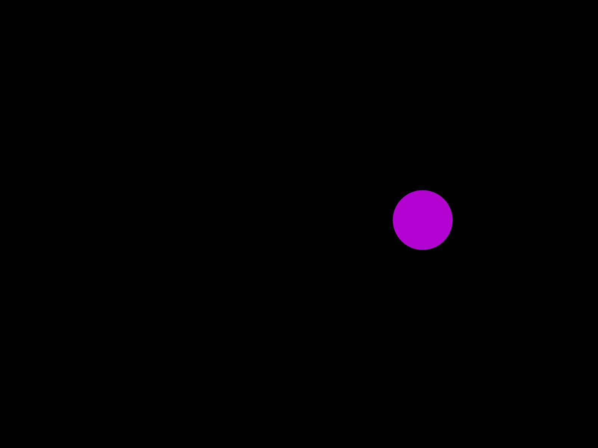

# Getting Started with P5js

## Hello World

So you want to make pictures with code? Perfect—p5.js is basically Processing’s JavaScript‑savvy little sibling, built for the browser and ridiculously easy to spin up. Drop one script tag, write a setup() and a draw(), and you’re already painting pixels. The library handles all the boring canvas plumbing, so you can jump straight to the fun bits -- random lines, kaleidoscopic color, even interactive sketches -- without wrestling a build system or a GPU API.

In this post we’ll start from absolute zero: an index.html that pulls in the p5.js CDN, a bare‑bones script.js with createCanvas(), and a first “hello world” doodle driven by a sprinkle of randomness. If you’d rather poke around before we dive in, crack open the official docs at [p5js.org](https://p5js.org/reference/) or play in the [Web Editor](https://editor.p5js.org/) -- then come back and follow along.

## The setup

### 1. Scaffold the files
Create a new folder, call it p5‑sandbox or whatever feels nice. Inside, add two files:

#### index.html

```{html}
<!DOCTYPE html>
<html lang="en">
  <head>
    <meta charset="utf-8" />
    <title>My First p5.js Sketch</title>

    <!-- p5.js CDN: put this BEFORE your own script -->
    <script src="https://cdn.jsdelivr.net/npm/p5@1.9.2/lib/p5.min.js"></script>

    <!-- your sketch -->
    <script src="script.js" defer></script>
  </head>
  <body></body>
</html>
```

#### script.js

```{js}
function setup() {         // called once at start
  createCanvas(800, 600);  // 800 × 600 canvas
  background(0);           // black bg
  noStroke();              // no stroke around shapes
}

function draw() {          // called every frame
  noLoop()                 // only render one image not an animation
  fill(random(255),
       random(255),
       random(255));       // random RGB fill
  ellipse(width / 2,
          height / 2,
          80, 80);         // circle at canvas center
}
```

Save both. That’s all the code you need to start flinging circles around the screen.

### 2. Fire up a quick server

Browsers block local file access for modules, so double‑clicking index.html may give you a blank page. Spin up a tiny server instead:

|  Tool                   |  How                                                                                                                                                           |
| ----------------------- | -------------------------------------------------------------------------------------------------------------------------------------------------------------- |
| **VS Code Live Server** | Install the *Live Server* extension → open **index.html** → **Right‑click → “Open with Live Server.”** Your default browser pops with http://127.0.0.1:5500. |
| **Python (built‑in)**   | In the project folder:<br>python3 -m http.server 8000<br>Then visit http://localhost:8000 in your browser.                                                 |


Next up we’ll tame that randomness and add interaction, but for now enjoy the happy chaos!


Keep refreshing the page to see the randomness at play.

## Embracing the Chaos

Uniform randomness (random()) scatters values evenly across a range—think confetti.
Gaussian randomness (randomGaussian()) piles most values near a mean, with fewer outliers—think dartboard with a heavy bullseye.

Why care? Gaussian lets you keep the action near a focal point (hello, composition) while still serving up surprises.

> | TL;DR: random() for wild scatter, randomGaussian() for controlled drift.

## Step‑by‑Step: From Centered Circle to Center‑Biased Scatter

1. Add some global knobs—so adjustments live in one spot.

```{js}
// === tweakables ===
const CENTER_X = 400;   // μ for X
const CENTER_Y = 300;   // μ for Y
const SPREAD_X = 100;   // σ (pixels) for X
const SPREAD_Y = 50;    // σ (pixels) for Y
```

#### 2. Wrap the drawing logic in its own function (keeps draw() clean).

```{js}
function randomCircle() {
  const x = randomGaussian(CENTER_X, SPREAD_X);
  const y = randomGaussian(CENTER_Y, SPREAD_Y);

  fill(random(255), random(255), random(255));
  ellipse(x, y, 80, 80);
}
```

#### 3. Call it from draw() -- still a one‑shot render thanks to noLoop().

```{js}
function draw() {
  noLoop();
  randomCircle();
}
```

#### 4. Refresh the page (or hit Run in the Web Editor) for a new layout every time.

Want more dots? Call randomCircle() a few times or yank out noLoop() refresh and watch them accumulate.

### Full updated script.js

```{js}
// === tweakables ===
const CENTER_X = 400;   // μ for X
const CENTER_Y = 300;   // μ for Y
const SPREAD_X = 100;   // σ (pixels) for X
const SPREAD_Y = 50;    // σ (pixels) for Y

function setup() {               // called once at start
  createCanvas(800, 600);        // 800 × 600 canvas
  background(0);                 // black bg
  noStroke();                    // no stroke around shapes
}

function draw() {                // called every frame
  noLoop();                      // one‑frame render
  randomCircle();                // splat a dot
}

function randomCircle() {
  const x = randomGaussian(CENTER_X, SPREAD_X);
  const y = randomGaussian(CENTER_Y, SPREAD_Y);
  fill(random(255), random(255), random(255));  // random RGB
  ellipse(x, y, 80, 80);                        // circle
}
```

Give it a few refreshes to see what the new randomness adds.



## Turning One Dot into Many

We’ve got a single Gaussian‑placed circle—time to make it sing with blend modes, transparency, and repetition.

#### 1. Add a couple new “knobs”
```{js}
// === tweakables ===
const CENTER_X   = 400;  // μ for X
const CENTER_Y   = 300;  // μ for Y
const SPREAD_X   = 100;  // σ for X
const SPREAD_Y   = 50;   // σ for Y
const DOT_ALPHA  = 100;  // 0‑255, lower = more see‑through
const DOT_COUNT  = 10;   // how many dots to fling
```

Why these new constants

- DOT_ALPHA lets color stacks glow instead of flattening.
- DOT_COUNT controls number of circles.

#### 2. Set the blend mode once in setup()

```{js}
function setup() {
  createCanvas(800, 600);
  background(0);
  noStroke();
  blendMode(ADD);  // <— new blend mode
}
```

- blendMode() picks how colors mingle
    - ADD = light‑painting
    - MULTIPLY = ink wash
    - SCREEN = photo overlay-ish.

Full list of modes lives in the p5.js docs → [blendMode() reference](https://p5js.org/reference/p5/blendMode/). Play around by choosing different modes and see dramatically different results.

#### 3. Loop the circle spawner

```{js}
function draw() {
  noLoop();               // one‑frame render
  for (let i = 0; i < DOT_COUNT; i++) {
    randomCircle();
  }
}
```

#### 4. Respect the new alpha in the fill

```{js}
function randomCircle() {
  const x = randomGaussian(CENTER_X, SPREAD_X);
  const y = randomGaussian(CENTER_Y, SPREAD_Y);
  fill(random(255), random(255), random(255), DOT_ALPHA); // RGBA
  ellipse(x, y, 80, 80);
}
```

### Full updated script.js

```{js}
// === tweakables ===
const CENTER_X   = 400;
const CENTER_Y   = 300;
const SPREAD_X   = 100;
const SPREAD_Y   = 50;
const DOT_ALPHA  = 100;         // transparency
const DOT_COUNT  = 10;          // how many dots

function setup() {
  createCanvas(800, 600);
  background(0);
  noStroke();
  blendMode(ADD);             // set color‑mixing style
}

function draw() {
  noLoop();
  for (let i = 0; i < DOT_COUNT; i++) {
    randomCircle();
  }
}

function randomCircle() {
  const x = randomGaussian(CENTER_X, SPREAD_X);
  const y = randomGaussian(CENTER_Y, SPREAD_Y);
  fill(random(255), random(255), random(255), DOT_ALPHA);
  ellipse(x, y, 80, 80);
}
```


### Tinker Time
Swap MODE between ADD, SCREEN, and MULTIPLY—watch the composition change dramatically.

Slide DOT_ALPHA down to 20 for dreamy haze or up to 120 for punchy speckles.

Crank DOT_COUNT to 10000 what affect does that achieve? Does it differ with the different blend modes?

Refresh and repeat. Each tweak is one variable away -- exactly the low‑friction play loop that keeps you sketching long after you meant to stop.

## Now Just Explore
This is where the “tutorial” part officially ends --everything below the fold is pure play. From here it’s almost criminally easy to riff on what we’ve built:

- Swap out full‑spectrum RGB for a curated palette, so the colors harmonize instead of shouting.

- Let Perlin noise nudge the center point a few pixels each dot, giving the whole swarm a gentle drift.

- Vary dot size, alpha, even blend mode inside the loop for happy accidents on every frame.

I went down that rabbit hole myself, tinkered with a muli-color palette, layered in noise, and ended up with something that I find compositionally interesting. Below is the final sketch I landed on—feel free to copy it and push the chaos further.


## My source Code
```
// === tweakables ===
const CENTER_X   = 400;
const CENTER_Y   = 300;
const SPREAD_X   = 300;
const SPREAD_Y   = 150;
const DOT_ALPHA  = 100;
const DOT_COUNT  = 100;
const NOISE_DIFF = 30;

let palette = [];

function setup() {
  createCanvas(800, 600);
  colorMode(HSB, 360, 100, 100, 255);
  pixelDensity(2);
  background(0);
  noStroke();
  blendMode(ADD);

  const baseHue = random(360);
  const baseSat = random(60, 100);
  for (let i = -2; i <= 2; i++) {
    let h = (baseHue + i * 20 + 360) % 360;
    let b = random(50, 100);
    palette.push(color(h, baseSat, b, DOT_ALPHA));
  }
  // Complementary
  palette.push(color((baseHue + 180) % 360, baseSat, random(50, 100), DOT_ALPHA));
}

function draw() {
  noLoop();
  for (let i = 0; i < DOT_COUNT; i++) {
    randomCircle();
  }
  addNoise();
}

function randomCircle() {
    const x = randomGaussian(CENTER_X, SPREAD_X);
    const y = randomGaussian(CENTER_Y, SPREAD_Y);
    const size = random(90, 160); // previously fixed at 80
    fill(random(palette));
    ellipse(x, y, size, size);
  }

function addNoise() {
  loadPixels();
  for (let i = 0; i < width*4; i++) {
    for (let j = 0; j < height*4; j++) {
      let index = (i + j * width) * 4;
      let r = pixels[index];
      let g = pixels[index + 1];
      let b = pixels[index + 2];

      if (r !== 0 || g !== 0 || b !== 0) {
        r += random(-NOISE_DIFF, NOISE_DIFF);
        g += random(-NOISE_DIFF, NOISE_DIFF);
        b += random(-NOISE_DIFF, NOISE_DIFF);

        pixels[index]     = constrain(r, 0, 255);
        pixels[index + 1] = constrain(g, 0, 255);
        pixels[index + 2] = constrain(b, 0, 255);
      }
    }
  }
  updatePixels();
}
```