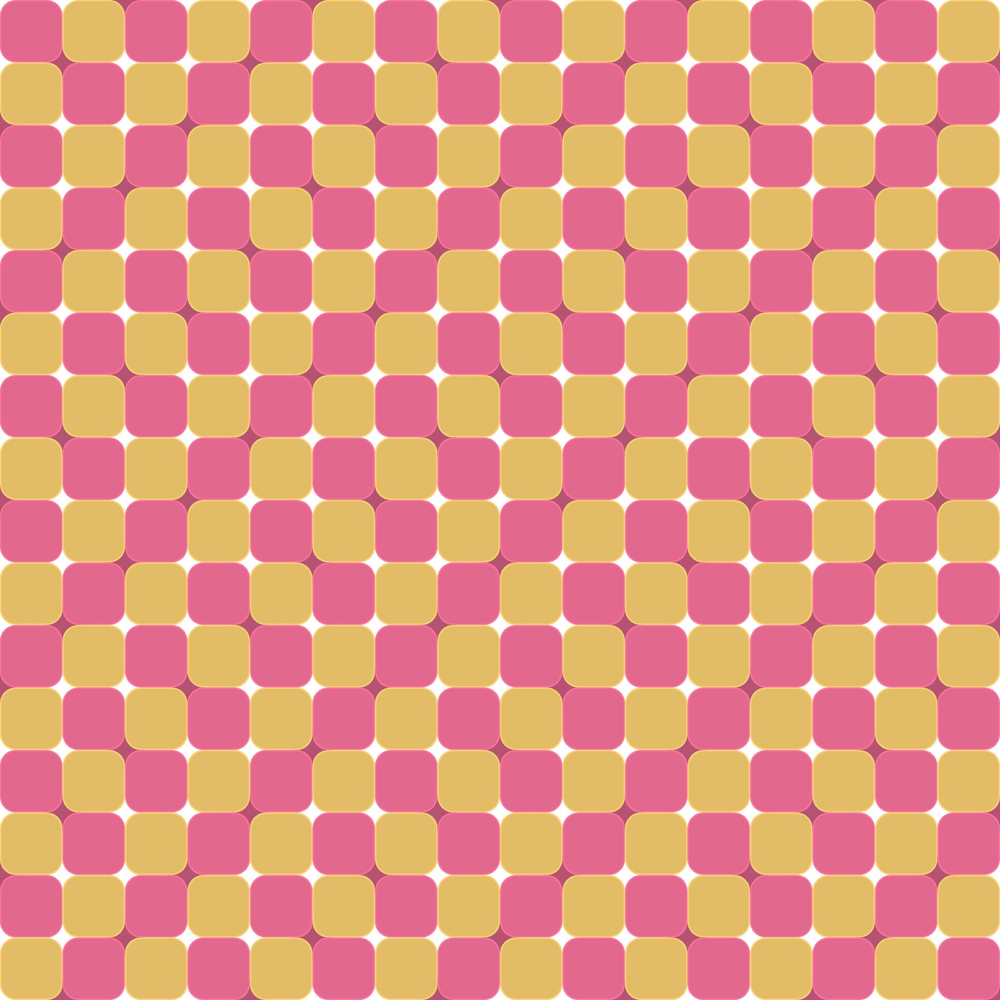

# Heat Waves




## Final Images


## Source Code

```js

const NOISE_DIFF = 20

let colorA, colorB, circleColor;
let numCells;
let cellSize;

function setup() {
    createCanvas(windowHeight, windowHeight);
    pixelDensity(2);
    colorMode(HSB, 360, 100, 100);
    noStroke();

    numCells = floor(random(11, 18));
    let s = random(40, 60);
    let b = random(80, 90);
    let base = random(360);
    colorA = color(base, s, b);
    colorB = color((base + 60) % 360, s, b);
    circleColor = color(base, s, b * 0.8);

    updateCellSize();
    noLoop();
}

function draw() {
    background(200);

    // draw circles in a diagonal pattern (top-right corner of squares)
    for (let y = -1; y < numCells + 1; y++) {
        for (let x = -1; x < numCells + 1; x++) {
            if ((x + y) % 3 === 1) { // diagonal stripe pattern
                fill(circleColor);
                let cx = (x + 1) * cellSize;
                let cy = y * cellSize;
                ellipse(cx, cy, cellSize * 0.6);
            }
        }
    }

    // simulate inner stroke by drawing two rectangles
    for (let y = 0; y < numCells; y++) {
        for (let x = 0; x < numCells; x++) {
            let isA = (x + y) % 2 === 0;
            let baseColor = isA ? colorA : colorB;
            let strokeCol = color(hue(baseColor), saturation(baseColor), min(brightness(baseColor) + 10, 100));
            let sw = cellSize * 0.02;
            let cx = x * cellSize;
            let cy = y * cellSize;

            // outer rect = stroke
            fill(strokeCol);
            noStroke();
            rect(cx, cy, cellSize, cellSize, cellSize * 0.25);

            // inner rect = fill
            fill(baseColor);
            let inset = sw;
            rect(cx + inset, cy + inset, cellSize - 2 * inset, cellSize - 2 * inset, (cellSize - 2 * inset) * 0.25);
        }
    }

    addNoise()
}


function windowResized() {
    resizeCanvas(windowHeight, windowHeight);
    updateCellSize();
}

function updateCellSize() {
    cellSize = height / numCells;
}


function addNoise() {
    loadPixels()
    for (let i = 0; i < width * pixelDensity(); i++) {
        for (let j = 0; j < height * pixelDensity() * 4; j++) {
            let index = (i + j * width) * 4
            let r = pixels[index]
            let g = pixels[index + 1]
            let b = pixels[index + 2]

            if (r !== 255 || g !== 255 || b !== 255) {
                r += random(-NOISE_DIFF, NOISE_DIFF)
                g += random(-NOISE_DIFF, NOISE_DIFF)
                b += random(-NOISE_DIFF, NOISE_DIFF)

                pixels[index] = constrain(r, 0, 255)
                pixels[index + 1] = constrain(g, 0, 255)
                pixels[index + 2] = constrain(b, 0, 255)
            }
        }
    }
    updatePixels()
}
```