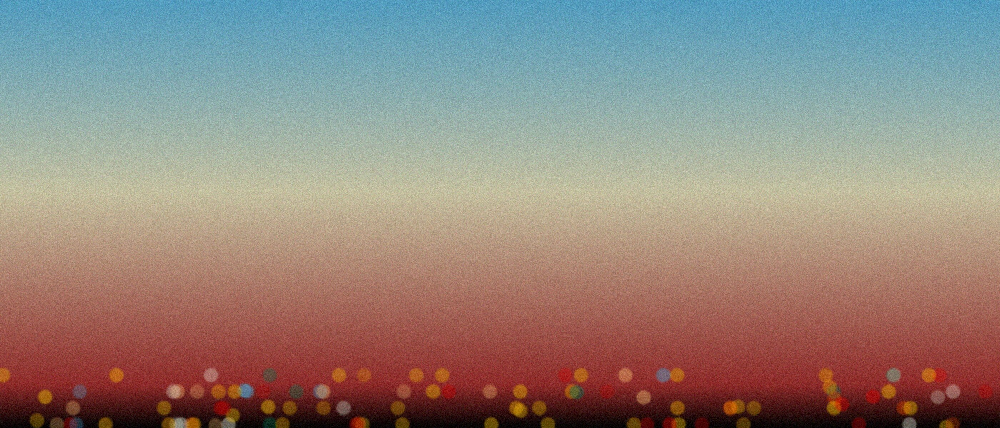
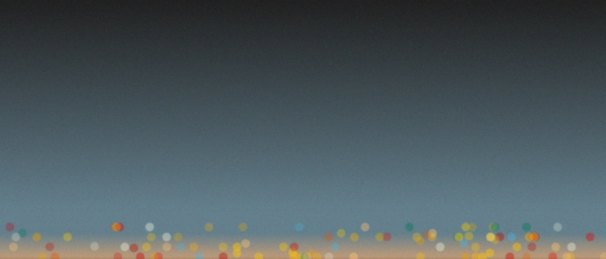
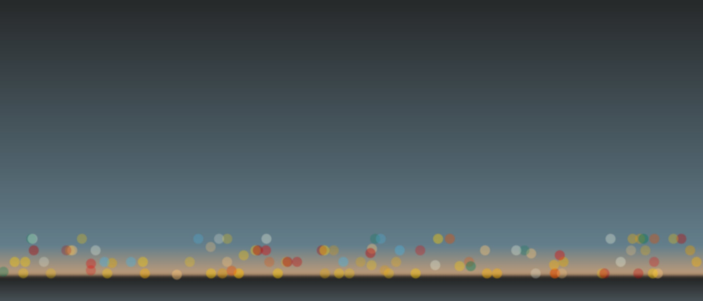
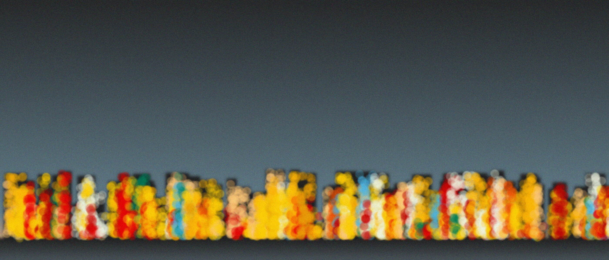
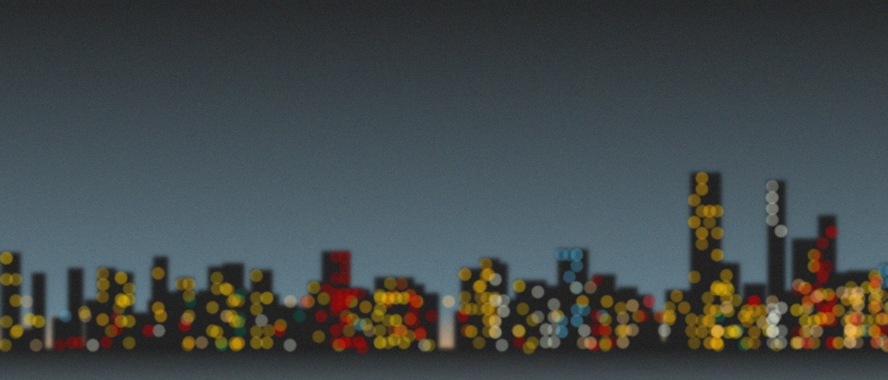
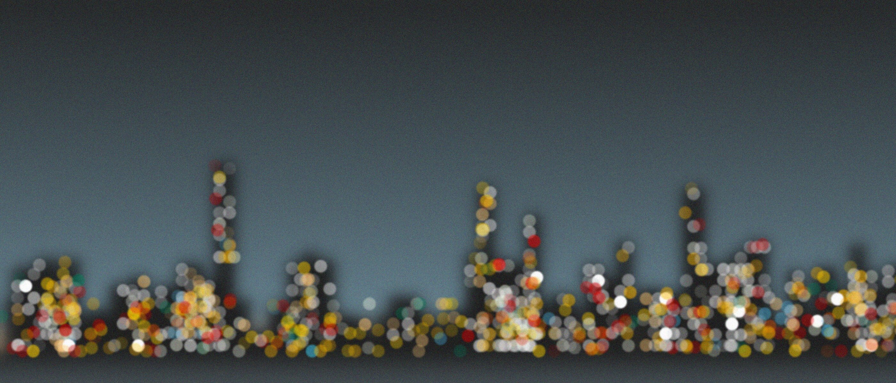
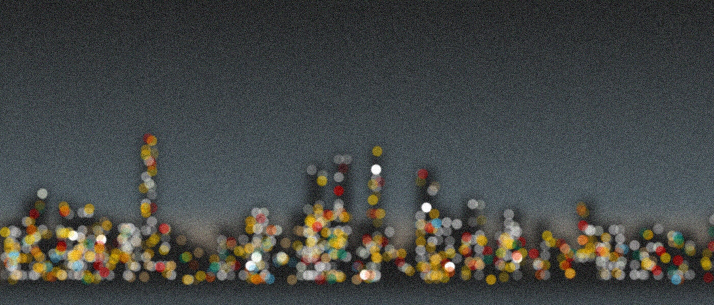
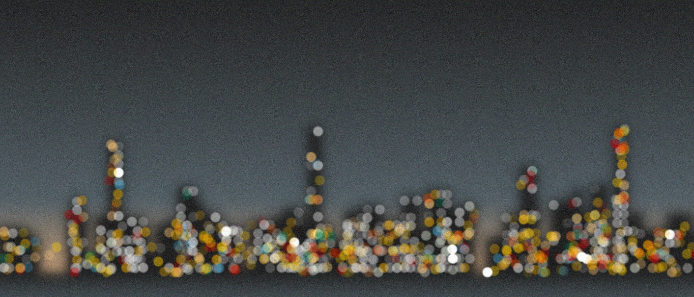
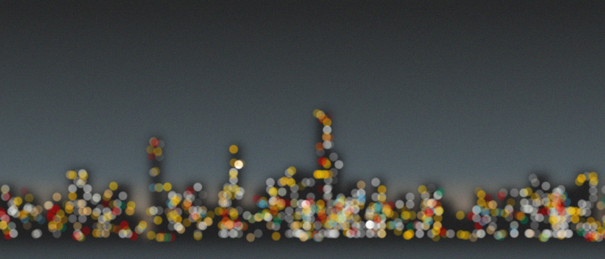

# New York at Night

I just got back from visiting New York. It is only logical then that I create a generative art procedurally created city skyline of NY.

## Adapting the existing

A while back I had created this distant city artwork. Designed to look like an out of focus town at sunset. I will be adapting this project for the New York at Night skyline.



First let me add some noise and change the background gradient to something resembling night time a little more.



Now, after looking at reference images for a while, it seems most skyline images include the water in the foreground. I will include a reverse gradient below to suggest the same thing.



Now let me add a bunch of randomly generating rectangular "buildings" each building is a structure stored in an array of all buildings. After they are drawn I will go over them again and dd lights to them as well.



Whoops, now I would say that both the buildings are a little too regular as ell as the lights too populated. I will decrease the amount of lights.



The number of lights is better now, certainly. However, I do not like how regular and colored the lights are. I am going to decrease the saturation of the building lights as well as make the opacity random. In other words adding variability to the brightness of the lights.



Oh, that is much better. It is starting to actually look like the City. Let me change the gradient slightly and create some final images.

## Final Images







## Source Code

```js
const NOISE_DF = 10
const WATER_LINE = 50
const BUILDING_NUMBER = 200
const LIGHT_FACTOR = 0.9

const LIGHT_ON_CHANCE = 0.35
const EXTRA_BUILDING_LIGHTS = 100
const RANDOM_LIGHTS = 50

function setup() {
    createCanvas(600, 600)
    noLoop()
    pixelDensity(2)
    noStroke()
}
const NOISE_DIFF = 20

function draw() {
    let topColor = color("#212121")
    let lowerMiddleColor = color("#546066")
    let bottomColor = color("#c49d78")
    let cuttoff = 0.76

    for (let y = 0; y < height; y++) {
        let inter = 0
        if (y < height * cuttoff) {
            inter = map(y, 0, height * cuttoff, 0, 1)
            let c = lerpColor(topColor, lowerMiddleColor, inter)
            stroke(c)
        } else {
            inter = map(y, height * cuttoff, height, 0, 1)
            let c = lerpColor(lowerMiddleColor, bottomColor, inter)
            stroke(c)
        }
        line(0, y - WATER_LINE, width, y - WATER_LINE)
    }

    for (let y = 0; y < WATER_LINE; y++) {
        let topWater = color("#485257")
        let bottomWater = color("#212121")
        let inter = map(y, 0, WATER_LINE, 0, 1)
        let c = lerpColor(topWater, bottomWater, inter)
        stroke(c)
        line(0, height - y, width, height - y)
    }

    // Draw buildings
    let buildingData = []
    for (let i = 0; i < BUILDING_NUMBER; i++) {
        let buildingWidth = random(20, 50)
        let buildingHeight = constrain(randomGaussian(60, 50), 0, 250)
        if (random() < 0.03) {
            buildingWidth = random(20, 35)
            buildingHeight = random(200, 300)
        }
        let buildingX = random(width)
        buildingData.push({
            x: buildingX,
            w: buildingWidth,
            h: buildingHeight,
            color: color("#212121"),
        })
    }

    buildingData.sort((a, b) => a.x - b.x)

    for (let b of buildingData) {
        fill(b.color)
        rect(b.x, height - WATER_LINE - b.h, b.w, b.h)
    }

    filter(BLUR, 20)

    let circleColors = [
        "#ffb500",
        "#c70000",
        "#4ab4e2",
        "#007a57",
        "#e60000",
        "#e89e00",
        "#ffb600",
        "#ecf3df",
        "#ecf3df",
        "#ffc878",
        "#ffc878",
        "#b80000",
        "#e94e00",
        "#e6ad00",
        "#ffcd00",
        "#ffcd00",
        "#ffcd00",
        "#ffcd00",
        "#ffcd00",
    ]

    let buildingLightColors = [
        "#f2f2f2",
        "#e6e6e6",
        "#cccccc",
        "#d9d9d9",
        "#bfbfbf",
        "#e0dcdc",
        "#ecf3df",
        "#d4d4d4",
        "#e8e8e8",
        "#f0f0f0",
        "#ffc878",
        "#ffb600",
    ]

    for (let i = 0; i < RANDOM_LIGHTS; i++) {
        let x
        if (random() > 0.5) {
            x = height - 5 - 23 * int(random(4)) - WATER_LINE
        } else {
            x = height - random(60) - WATER_LINE
        }
        noStroke()
        let col = circleColors[i % circleColors.length]
        fill(col + str(floor(random(40, 70))))
        ellipse(random(width), x, 20)
    }

    buildingData.sort((a, b) => b.h - a.h)
    let frontBuildings = buildingData.slice(0, int(BUILDING_NUMBER * 0.3))

    noStroke()
    for (let b of frontBuildings) {
        let cols = max(1, int(b.w / (10 / LIGHT_FACTOR)))
        let rows = max(1, int(b.h / (15 / LIGHT_FACTOR)))
        let cellW = b.w / cols
        let cellH = b.h / rows

        for (let i = 0; i < cols; i++) {
            for (let j = 0; j < rows; j++) {
                if (random() < LIGHT_ON_CHANCE) {
                    let lightX = b.x + cellW * (i + 0.5)
                    let lightY = height - WATER_LINE - b.h + cellH * (j + 0.5)
                    let alpha = floor(
                        constrain(randomGaussian(60, 20), 20, 100)
                    )
                    fill(
                        buildingLightColors[
                            int(random(buildingLightColors.length))
                        ] + str(alpha)
                    )
                    ellipse(lightX, lightY, 20)
                }
            }
        }
    }

    noStroke()
    for (let i = 0; i < EXTRA_BUILDING_LIGHTS; i++) {
        let b = buildingData[int(pow(random(1), 2) * buildingData.length)]
        let lightX = b.x + random(0, b.w)

        let relativeTopBias = constrain(abs(randomGaussian(0, 0.5)), 0, 0.5)
        let lightY = height - WATER_LINE - b.h + b.h * relativeTopBias

        let col = circleColors[int(random(circleColors.length))]
        let alpha = floor(constrain(randomGaussian(50, 20), 20, 100))
        fill(col + str(alpha))
        ellipse(lightX, lightY, 20)
    }

    filter(BLUR, 2)

    addNoise()
}

function addNoise() {
    loadPixels()
    for (let i = 0; i < width; i++) {
        for (let j = 0; j < height * 4; j++) {
            let index = (i + j * width) * 4
            let r = pixels[index]
            let g = pixels[index + 1]
            let b = pixels[index + 2]

            r += random(-NOISE_DIFF, NOISE_DIFF)
            g += random(-NOISE_DIFF, NOISE_DIFF)
            b += random(-NOISE_DIFF, NOISE_DIFF)

            pixels[index] = r
            pixels[index + 1] = g
            pixels[index + 2] = b
        }
    }
    updatePixels()
}

```
