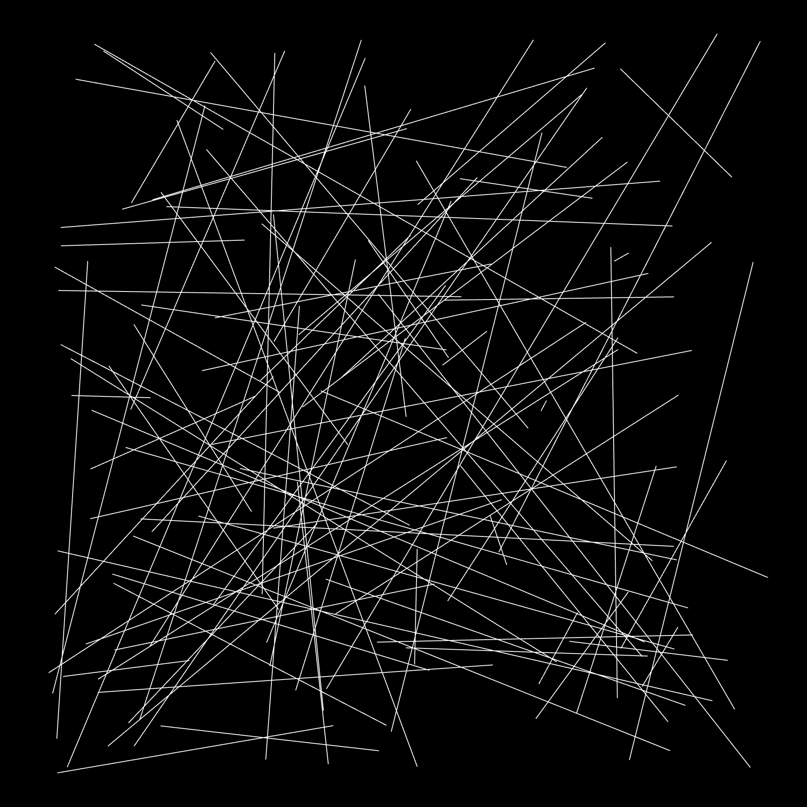
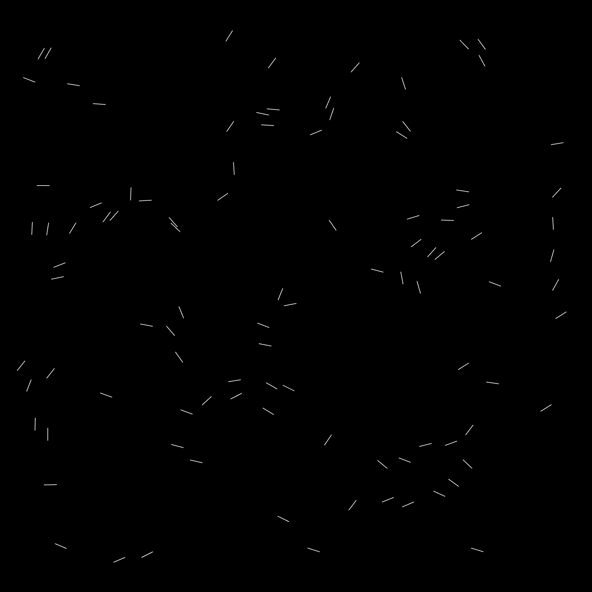
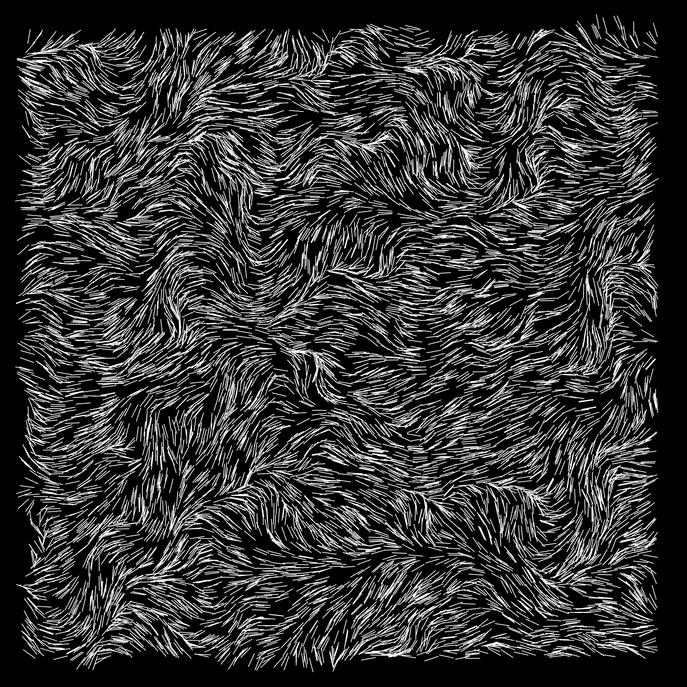
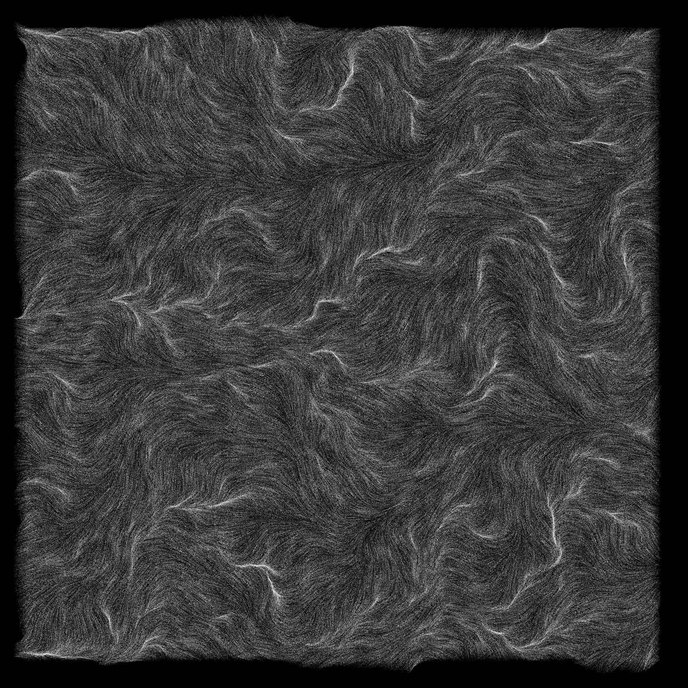
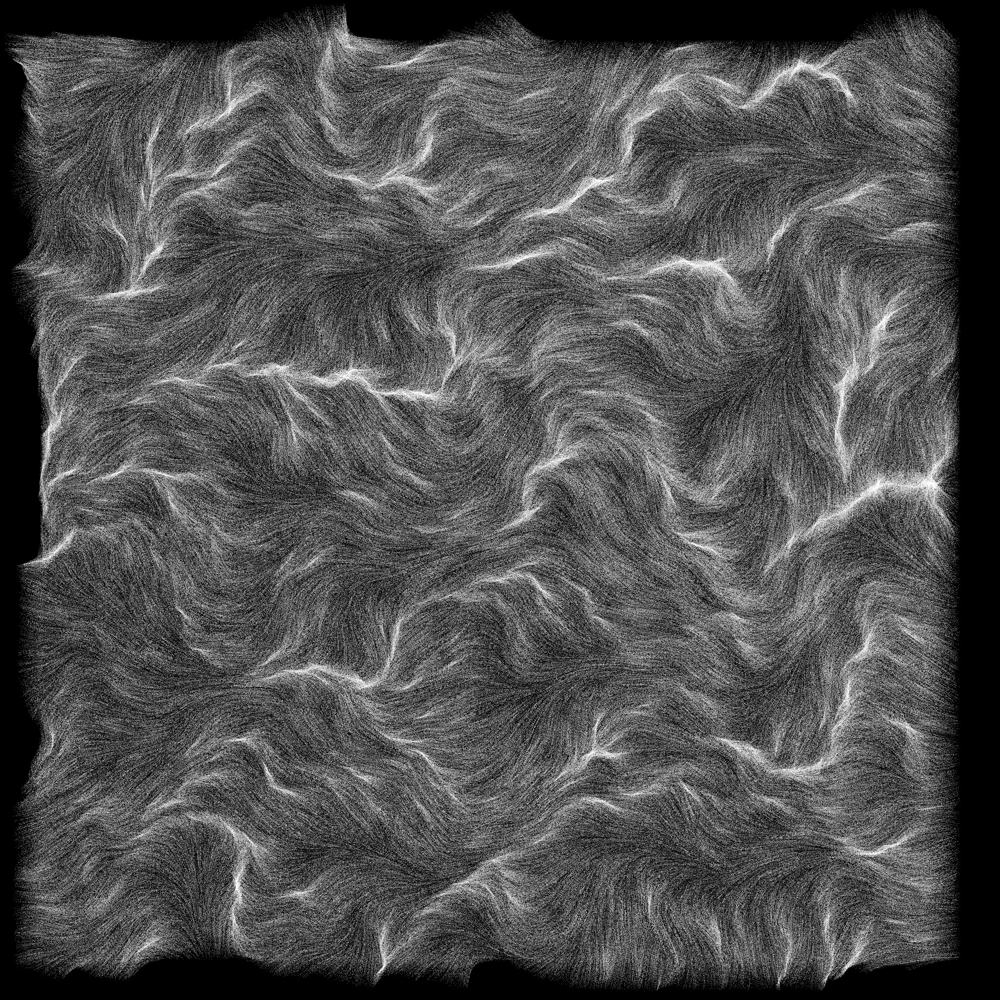
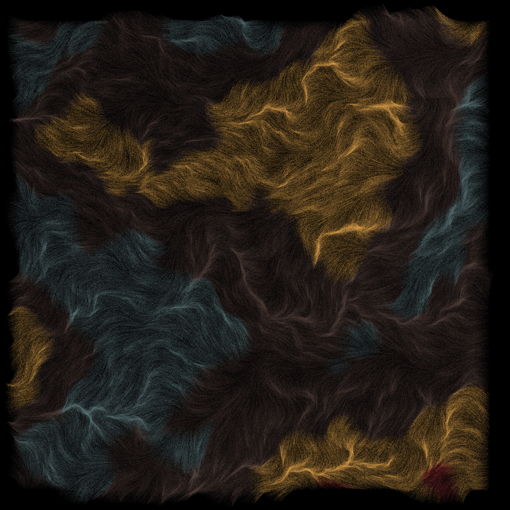
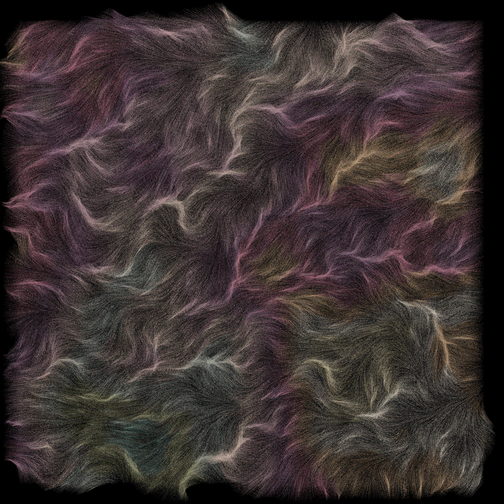
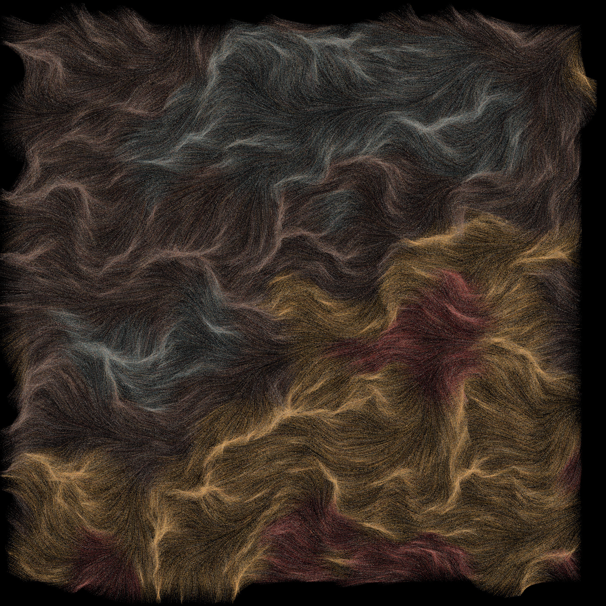
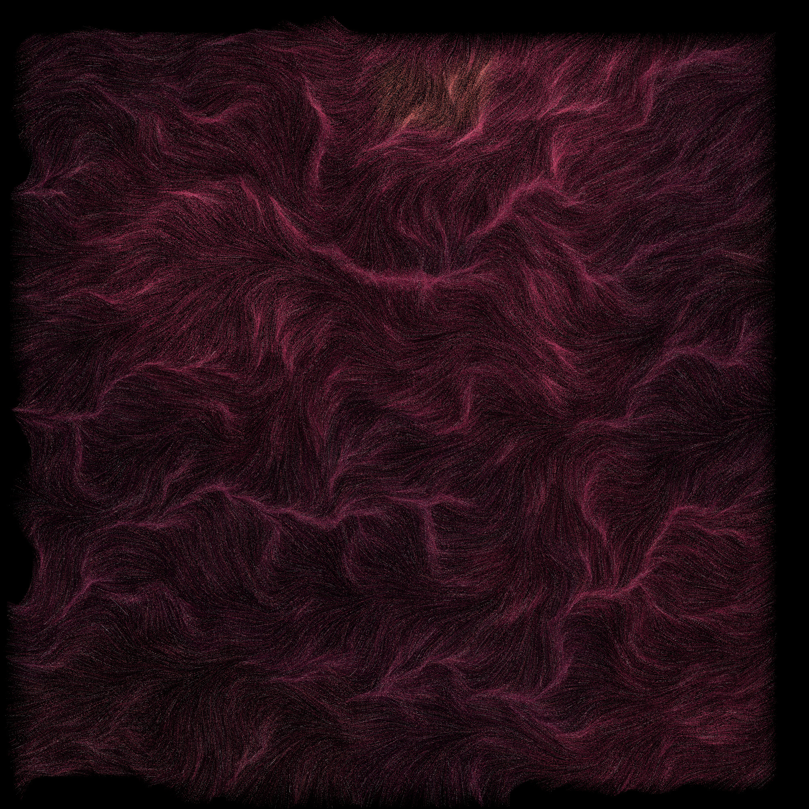
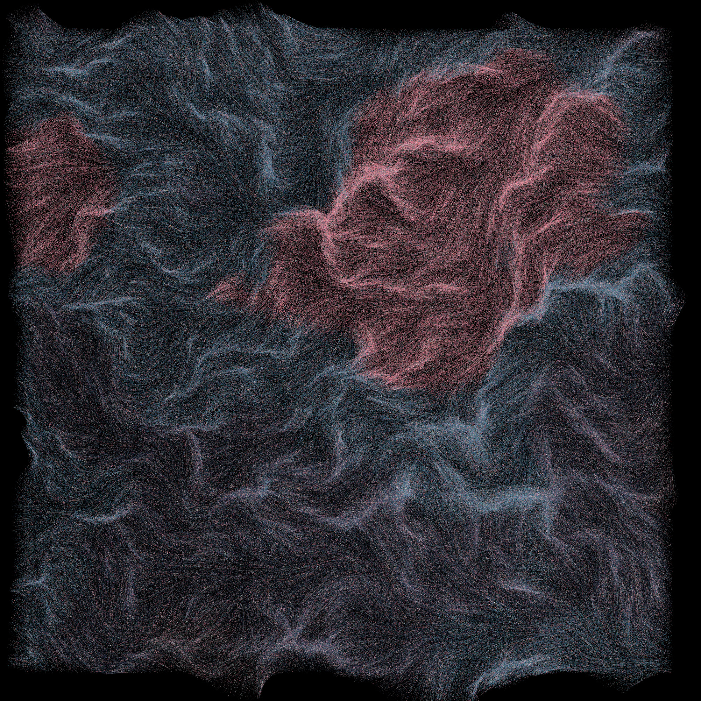

# Sprill

Hello again its me.

Second blog post in one week. Look at me being so productive. Ive just really been on a generative art kick recently and want to keep it going. As I start this project I have no idea where I want to go with it or even simply what I want to name it. I am going to come up with a random noncense word and write code that 'fits.' How about Sprill. Welcome to Sprill reader.

## Noise noise noise

Lets get started by creating a canvas and randomly placing 100 lines across it. Note that I have also added a boarder around the edge that is excluded from being a random start or end point of each line. This I think jsut helps make the image aprear cleaner and more professional.



Lets get into the noise now. Instead of the lines being randomly conecting two points they will randomly move 20 px from one of the ranomly selected points in an angle that is determined by noise. The noise will be passed the starting position of the line so that the noise pattern apears.



You cant quite see the pattern with so few lines. Time to add more.



Much better, I like the current scale of the nosie. But I want the lines to be thinner and for there to be far more.



Lets see if I can add another two dimentional noise texture. THis noise will be offset from the line orientation nose -- it will influence the lenght of the line.



Neat. I love the affect of the lines but now I want to add color. Better not do it entirely randomly though as there are too many lines and it would simply turn into a blob of one brown color. Lets define some color palette and ranodmly select one. Then add more noise that drives the selected index from the palette array



Cool! Though the difference between each color is a bit harsh. Instead I am going to add a random factor to the noise. A majority of the lines will be colored by the noise but some will be entirely randomly selected from the pallete. I am hoping this makes it more cohesive.

## Final Images

Below are a selection of final images. All generated from different palettes found on Lospec.com.






## Source Code

```js
const NOISE_SCALE = 0.01;
const NUMBER_LINES = 500000;
const BOARDER = 40;
let offsetX, offsetY, offsetZ, offsetColor;
let paletteColors = [];

function preload() {
  // Replace these with actual palette file paths in the 'palette' subdirectory
  let palettes = [
    "palette/pal1.hex",
    "palette/pal2.hex",
    "palette/pal3.hex",
    "palette/pal4.hex",
    "palette/pal5.hex",
    "palette/pal6.hex",
];
  paletteColors = loadStrings(random(palettes));
}

function setup() {
  createCanvas(windowHeight, windowHeight);
  background(0);
  noFill();
  strokeWeight(0.025);
  noLoop();

  offsetX = random(10000);
  offsetY = random(10000);
  offsetZ = random(10000);
  offsetColor = random(10000);
}

function draw() {
  background(0);
  for (let i = 0; i < NUMBER_LINES; i++) {
    let x = random(BOARDER, width - BOARDER);
    let y = random(BOARDER, height - BOARDER);

    let len = noise((x + offsetX) * NOISE_SCALE * 0.1, (y + offsetY) * NOISE_SCALE * 0.1) *
                    60 + 10;
    let angle = noise((x + offsetZ) * NOISE_SCALE, (y + offsetZ) * NOISE_SCALE) * TWO_PI;
    let colorIndex = floor(
      noise((x + offsetColor) * NOISE_SCALE * 0.25, (y + offsetColor) * NOISE_SCALE * 0.25) *
      paletteColors.length
    );
    if (random() > .5){
        stroke("#" + paletteColors[colorIndex]);
    }
    else {
        stroke("#" + random(paletteColors));
    }

    let x2 = x + cos(angle) * len;
    let y2 = y + sin(angle) * len;
    line(x, y, x2, y2);
  }
}

function windowResized() {
  resizeCanvas(windowHeight, windowHeight);
  redraw();
}
```