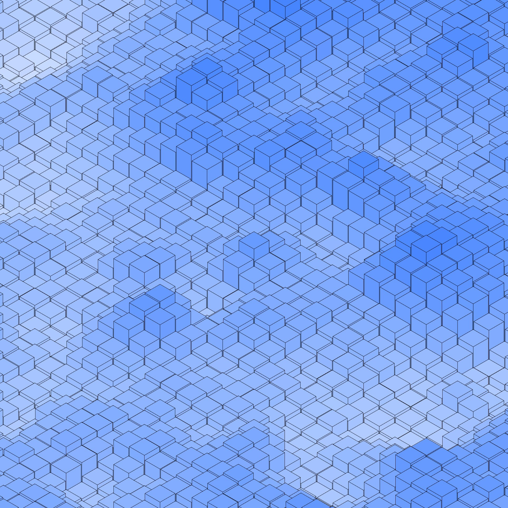
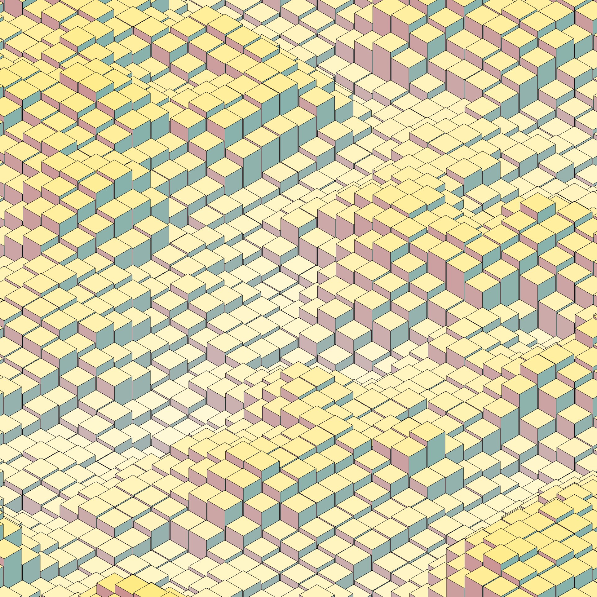

# Topology

### Step&nbsp;1 – Establishing the Base Mesh

A uniform field of extruded cubes is rendered to validate the orthographic camera setup, overall scale, and lighting.  


### Step&nbsp;2 – Introducing Low‑Frequency Noise

A coarse Perlin‑noise displacement is applied to the cube heights, creating gentle undulations across the surface.  


### Step&nbsp;3 – Increasing Noise Complexity

The noise frequency is raised, yielding a denser, more intricate topography while retaining the original color scheme. Cubes are no longer cubes but are square prisms.


### Step&nbsp;4 – Height‑Map Verification in Grayscale

Color is temporarily removed so that the height distribution can be inspected without chromatic distraction. Looks like something I did while adding the wireframe made the negative displacement stop working.


### Step&nbsp;5 – Re‑applying the Dynamic Hue Palette

Hue shifts tied to elevation are reinstated, confirming that color correctly tracks terrain relief with wireframe enabled.


### Step&nbsp;6 – Dialing in cube and wireframe sizes

The title is pretty self explanatory, I just dialed in the cube size, displacement and wireframe line weight.


### Step&nbsp;7 – Warm‑Spectrum Exploration

The palette is constrained to warm, orange tones to test mood variations and legibility at lower saturation.  


### Step&nbsp;8 – Cool‑Spectrum Exploration

A complementary study restricts hues to blues, evaluating depth perception and atmosphere.  



### Step&nbsp;9 – Selective Terrain Tinting

Localized hue modulation blends random colors with split complementary hue shifts to give a better sense of face normals. More or less, it makes the cubes seem more 3Ds


### Step&nbsp;10 – High‑Key Color Pass

Dialiing in hue and saturation offsets from random color generated.



### Step&nbsp;11 – Multi‑Hue Harmonisation

The final iterative pass balances multiple complementary hues, locking in the full color range.  


## Final Images


## Source Code

```{js}
let cols = 70
let rows = 70
let cubeSize = 40
let gap = 5
let noiseScale = 0.15
let noiseSpeed = 0.002
let heightFactor = 200
let baseHue
let pg

function setup() {
    createCanvas(windowHeight, windowHeight)
    pg = createGraphics(windowHeight, windowHeight, WEBGL)
    pg.angleMode(DEGREES)
    pg.colorMode(HSB, 360, 100, 100, 255)
    baseHue = random(360)
    noStroke()
    noLoop()
}

function draw() {
    // Draw to offscreen buffer
    pg.push()
    pg.clear()
    pg.ortho(-width / 2, width / 2, -height / 2, height / 2, -1000, 10000)
    const camDist = (cols + rows) * (cubeSize + gap) * 0.3
    pg.camera(camDist, -camDist, camDist, 0, 0, 0, 0, 1, 0)

    pg.translate(
        (-(cols - 1) * (cubeSize + gap)) / 2,
        0,
        (-(rows - 1) * (cubeSize + gap)) / 2
    )

    for (let z = 0; z < rows; z++) {
        for (let x = 0; x < cols; x++) {
            const yOff = map(
                noise(x * noiseScale, z * noiseScale, frameCount * noiseSpeed),
                0,
                1,
                -heightFactor,
                heightFactor
            )
            const h = cubeSize * 10

            pg.push()
            pg.translate(x * (cubeSize + gap), yOff, z * (cubeSize + gap))
            drawColoredBox(pg, 0, 0, 0, cubeSize, h, cubeSize, yOff)

            pg.stroke(0)
            pg.strokeWeight(3)
            pg.noFill()
            pg.box(cubeSize + 0.5, cubeSize * 10 + 0.5, cubeSize + 0.5)
            pg.pop()
        }
    }
    pg.pop()

    // Render to main canvas
    image(pg, 0, 0)

    // Apply base hue tint noise
    loadPixels()
    for (let i = 0; i < pixels.length; i += 4) {
        let r = pixels[i]
        let g = pixels[i + 1]
        let b = pixels[i + 2]

        if (r !== 0 || g !== 0 || b !== 0) {
            let blendAmt = random(0.05, 0.4)
            let tintColor = color(baseHue, 100, 100)
            let tr = red(tintColor)
            let tg = green(tintColor)
            let tb = blue(tintColor)

            pixels[i] = lerp(r, tr, blendAmt)
            pixels[i + 1] = lerp(g, tg, blendAmt)
            pixels[i + 2] = lerp(b, tb, blendAmt)
        }
    }
    updatePixels()

    // texture effect
    drawDiagonalTexture()
}

function drawColoredBox(g, x, y, z, w, h, d, heightOffset) {
    const hw = w / 2
    const hh = h / 2
    const hd = d / 2
    const saturation = map(heightOffset, -heightFactor, heightFactor, 60, 0)

    g.beginShape(g.QUADS)

    // Front face
    g.fill((baseHue - 120 + 360) % 360, saturation * 0.6, 80)
    g.vertex(-hw, -hh, hd)
    g.vertex(hw, -hh, hd)
    g.vertex(hw, hh, hd)
    g.vertex(-hw, hh, hd)

    // Right face
    g.fill((baseHue + 120) % 360, saturation * 0.6, 70)
    g.vertex(hw, -hh, hd)
    g.vertex(hw, -hh, -hd)
    g.vertex(hw, hh, -hd)
    g.vertex(hw, hh, hd)

    // Top face
    g.fill(baseHue, saturation, 100)
    g.vertex(-hw, -hh, -hd)
    g.vertex(hw, -hh, -hd)
    g.vertex(hw, -hh, hd)
    g.vertex(-hw, -hh, hd)

    g.endShape()
}

function drawDiagonalTexture(spacing = 2, alpha = 40, angleDeg = 30) {
    push()
    translate(width / 2, height / 2)
    rotate(radians(angleDeg))
    stroke(0, 0, 100, alpha)
    strokeWeight(1)

    const len = sqrt(sq(width) + sq(height)) * 2

    for (let i = -len; i < len; i += spacing) {
        line(i, -len, i, len)
    }

    pop()
}
```
