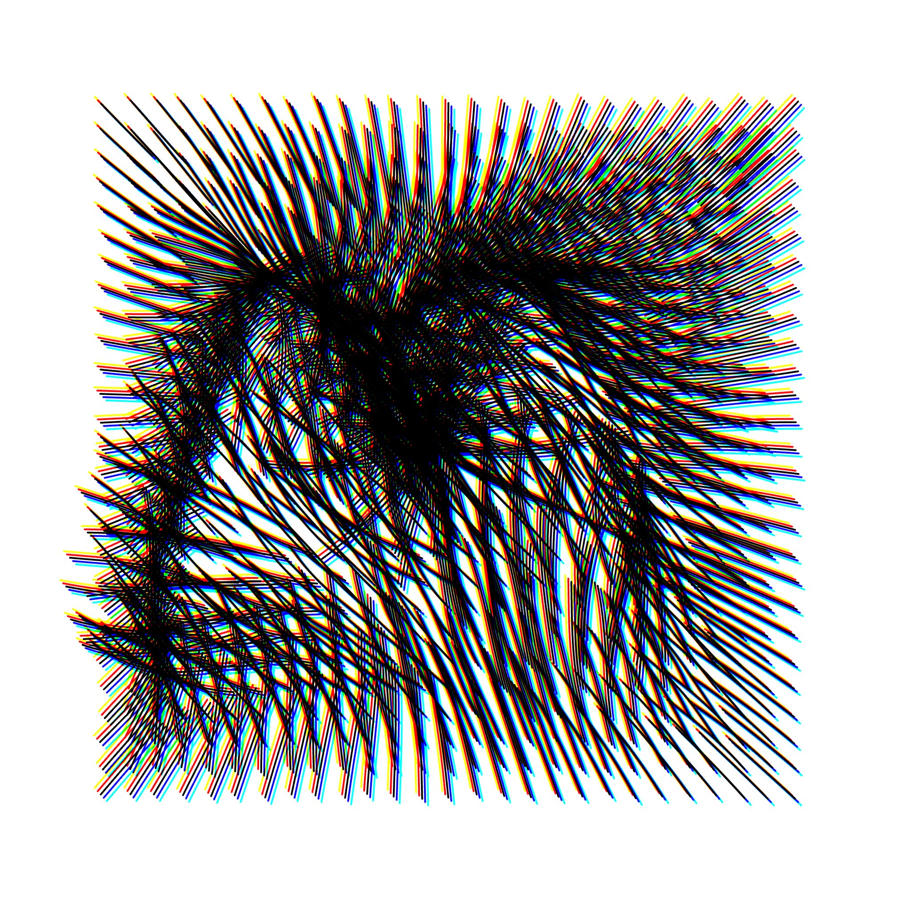
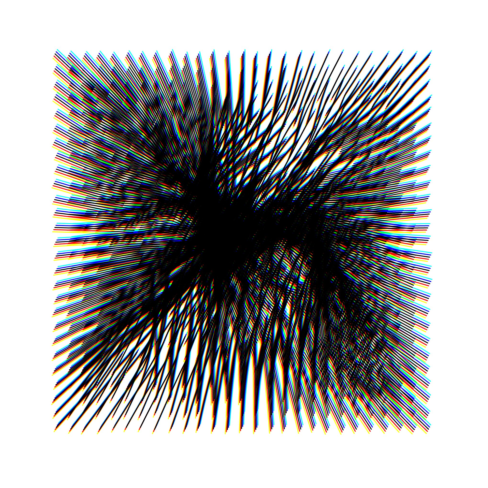
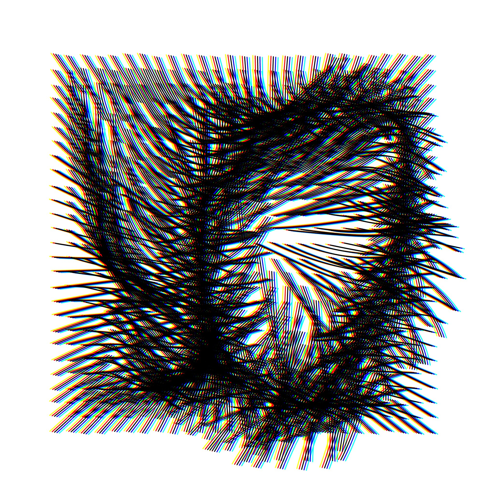
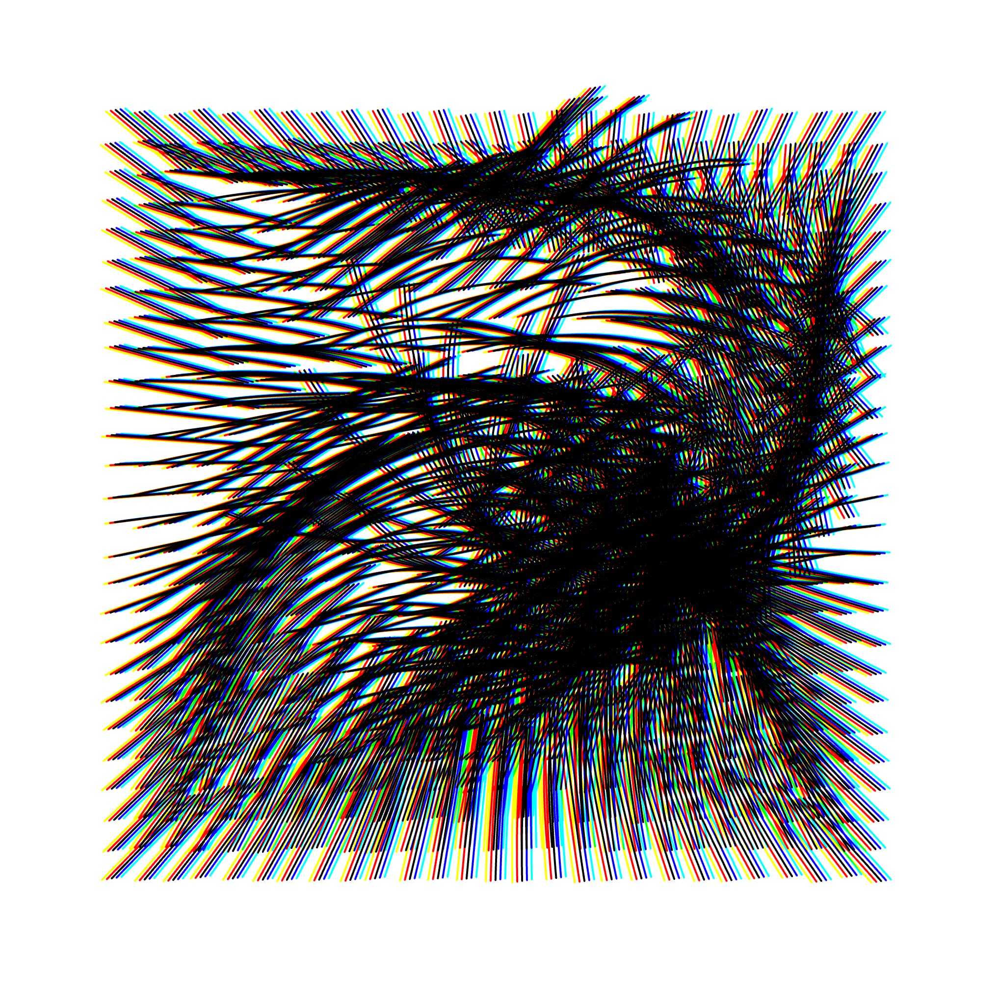
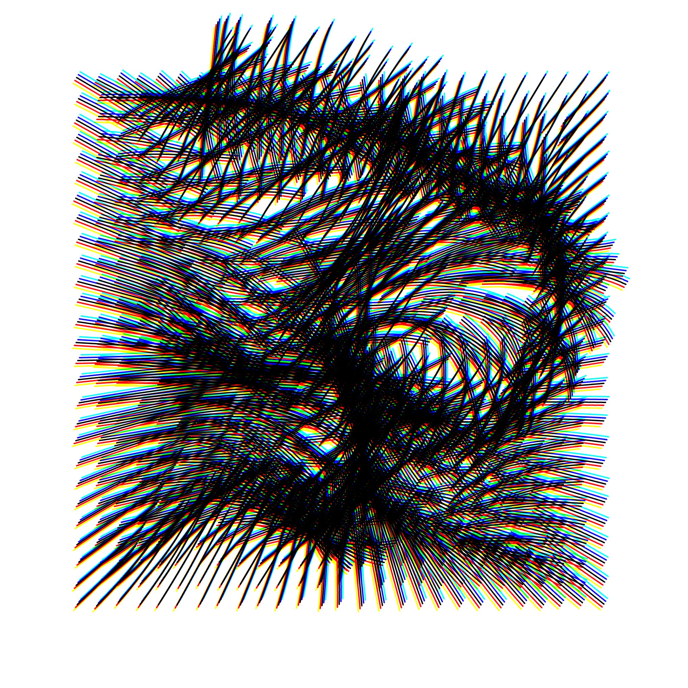
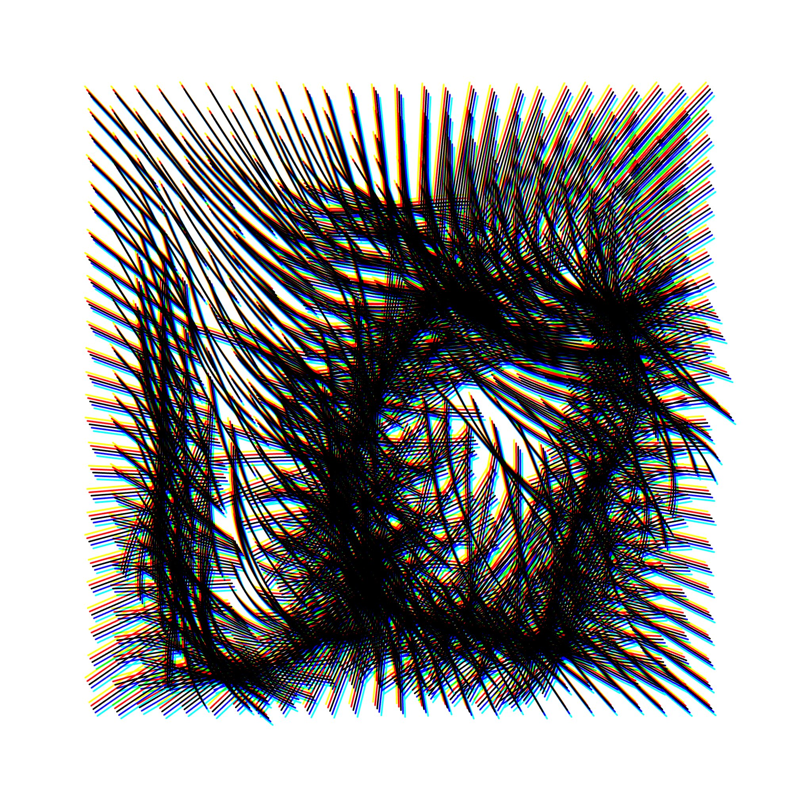
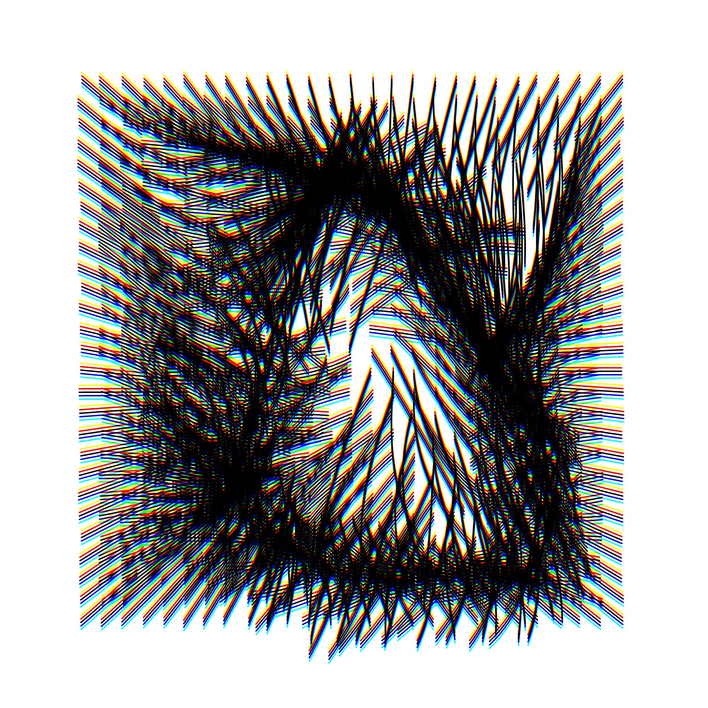
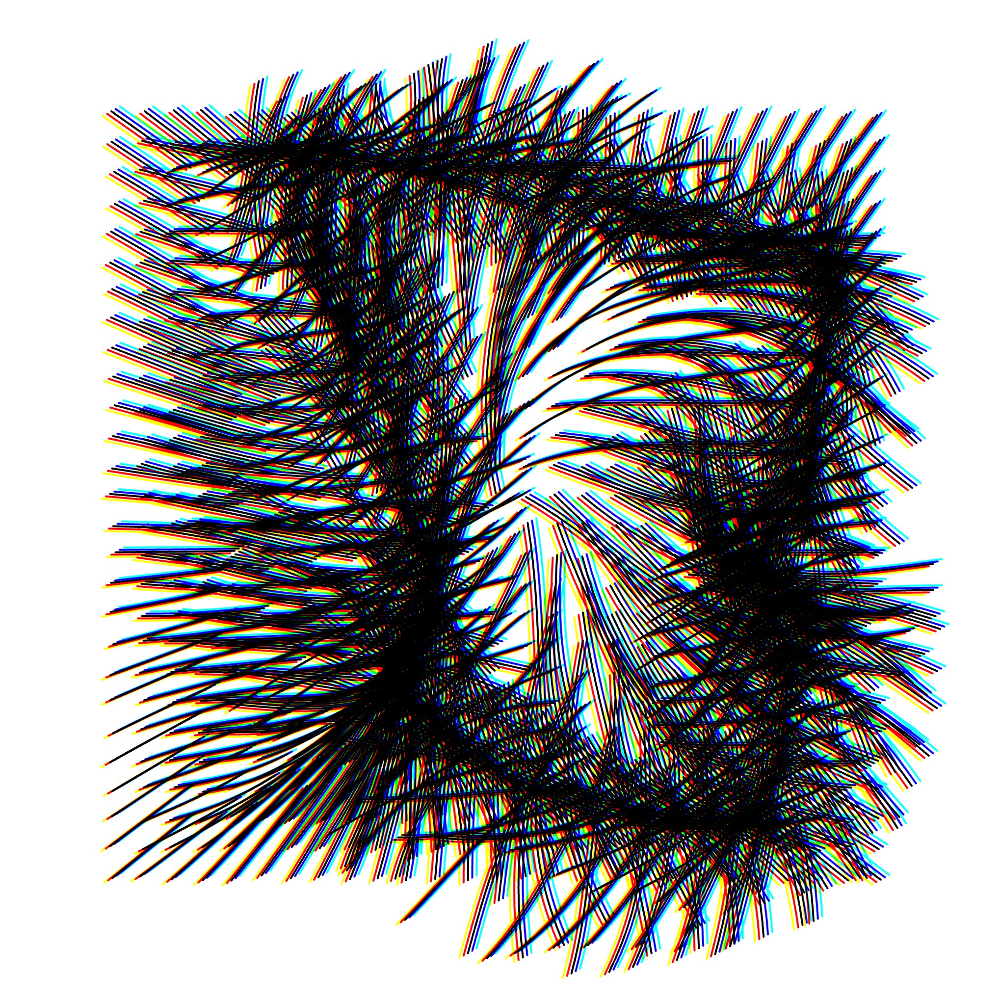

# Vector Nest

Not much to say here. Just check out the output images.

## Final Images










## Source Code

```{js}
let pg
let cols, rows
let spacing = 30
let noiseScale = 0.05
let abOffset = 5
let opacity = 256
let abAngle
let maxDist
let border = 100

function setup() {
    createCanvas(windowHeight, windowHeight)

    pg = createGraphics(windowHeight, windowHeight)
    pg.clear()
    pg.noFill()
    pg.strokeWeight(2)
    pg.stroke(255)

    cols = int((width - 2 * border) / spacing)
    rows = int((height - 2 * border) / spacing)

    abAngle = random(TWO_PI)
    maxDist = dist(width / 2, height / 2, border, border)

    drawCurvyLines(pg)
    noLoop()
}

function draw() {
    background(255)
    blendMode(MULTIPLY)

    const dx = cos(abAngle) * abOffset
    const dy = sin(abAngle) * abOffset

    tint(0, 255, 255, opacity)
    image(pg, -2 * dx, -2 * dy)

    tint(0, 0, 255, opacity)
    image(pg, -dx, -dy)

    tint(255, 0, 0, opacity)
    image(pg, dx, dy)

    tint(255, 255, 0, opacity)
    image(pg, 2 * dx, 2 * dy)

    blendMode(BLEND)

    tint(0)
    image(pg, 0, 0)
    tint(255)
}

function drawCurvyLines(g) {
    const cx = width / 2
    const cy = height / 2

    for (let i = 0; i < cols; i++) {
        for (let j = 0; j < rows; j++) {
            let baseX =
                i * spacing + spacing / 2 + border + random(-spacing / 10, spacing / 10)
            let baseY =
                j * spacing + spacing / 2 + border + random(-spacing / 10, spacing / 10)

            const segments = 16

            const d = dist(baseX, baseY, cx, cy)
            const cFactor = 1 - d / maxDist

            const edgeDist = min(
                baseX - border,
                width - border - baseX,
                baseY - border,
                height - border - baseY
            )
            const edgeFactor = constrain(1 - edgeDist / (border * 1.5), 0, 1)

            let lengthNoise = noise(i * noiseScale, j * noiseScale + 400)
            let lineLength = map(lengthNoise, 0, 1, 60, 140) * (1 + cFactor * 2)

            g.beginShape()
            for (let k = -1; k <= segments + 1; k++) {
                const t = k / segments
                const n = noise((i + t) * noiseScale, (j + t) * noiseScale)

                const angleAmp = 1 + cFactor
                const noiseAngle = map(n, 0, 1, -PI, PI) * angleAmp
                const toCenter = atan2(cy - baseY, cx - baseX)

                const baseAngle = toCenter
                const curveOffset = map(n, 0, 1, -PI, PI) * angleAmp * (1 - edgeFactor)
                const finalAngle = baseAngle + curveOffset
                const r = t * lineLength

                g.curveVertex(baseX + cos(finalAngle) * r, baseY + sin(finalAngle) * r)
            }
            g.endShape()
        }
    }
}

// helper: linear interpolate angles with wraparound
function lerpAngle(a, b, t) {
    const diff = atan2(sin(b - a), cos(b - a))
    return a + diff * t
}
```
